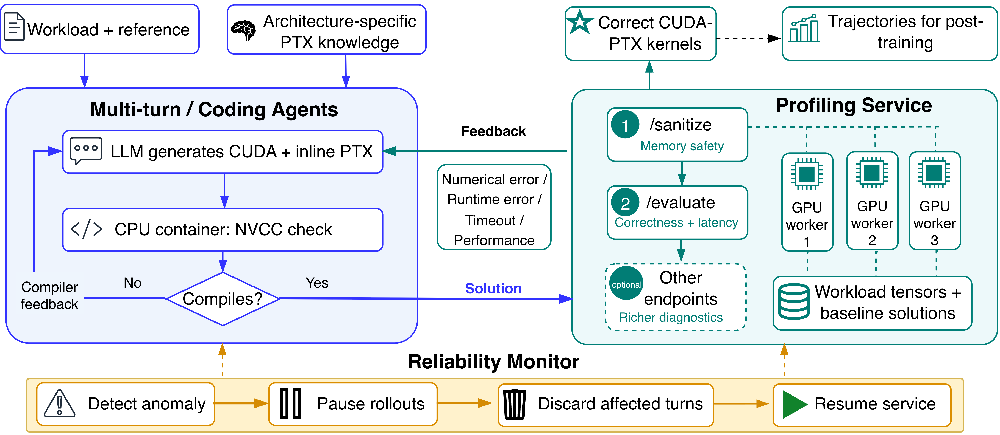

<div align="center">
    
</div> 

# PTXBench
[](https://arxiv.org/pdf/2608.17379)
[](https://zhang677.github.io/blog_md/ptxbench.html)
[](https://huggingface.co/collections/Genghan/ptxbench-qwen36-27b-sft-series

PTXBench contains one GPU profiling service and two ways to run kernel agents:
the multiturn model loop and the coding-agent gateway. Fixit SFT and KernelGen
use the same multiturn runner and prompt registry for source and final evaluation.
This repository gives the experiment process and a small set of runnable examples;
it does not include paper outputs, plots, or the full prepared experiment matrix.

| Directory | Purpose |
| --- | --- |
| `fib-profile/` | Five bundled H100 workload definitions and the GPU profiling service |
| `multiturn/` | Model loop, CUDA/Triton evaluator tests, prompt registry, and runner |
| `ptxbench-eval/` | Coding-agent gateway, launcher, agent images, and examples |
| `experiments/prepared/configs/` | One multiturn config example |
| `experiments/fixit/` | Failed-kernel repair, reasoning, SFT, serving, evaluation |
| `experiments/kernelgen/` | Correct-kernel reasoning, SFT, serving, evaluation |
| `experiments/shared/` | Run manifests, turn export, and shared training/serving code |

🚧 This repository is still under construction.

## Setup

Use Python 3.12, Docker with NVIDIA GPU access, `tmux`, and an H100 host for the
bundled workloads. SFT runtime-SASS export also needs host `nvcc`,
`cuobjdump`, and TVM-FFI headers/libraries. The profiling service has its own
environment in the Docker image; install the host runner and coding-agent
launcher separately:

```bash
python3.12 -m venv .venv
source .venv/bin/activate
pip install -e '.[sft,dev]'
pip install -e ./ptxbench-eval
pip install -r multiturn/requirements.txt
```

The SFT extra installs Tinker Cookbook for training and checkpoint handling.
Training also needs a Tinker account. For evaluation alone, `pip install -e .`
and the multiturn requirements suffice. Model provider credentials are read from
environment variables; see `.env.example`.

Start the service using [fib-profile/scripts/README.md](fib-profile/scripts/README.md).
For the backward attention workloads, generate the two checksum-verified input
blobs as described in [fib-profile/dataset/README.md](fib-profile/dataset/README.md)
before starting the service. Check service health with:

```bash
curl -fsS http://localhost:10000/health
```

Build the multiturn evaluator image:

```bash
docker build -f multiturn/docker/Dockerfile.eval -t ptxbench-multiturn-eval:latest .
```

## Multiturn model loop

The runner expands a JSON config into trajectories and writes a `plan.json`,
trajectories, logs, and success artifacts into a new output root. The shared
prompt registry is `multiturn/prompts/hub.json`; assembled documents are under
`multiturn/prompts/assembled`. The same runner supports CUDA and Triton test
scripts under `multiturn/tests/`.

```bash
export GEMINI_API_KEY=...  # for this example model
python multiturn/scripts/render.py --check
python multiturn/run_parallel_v2.py \
  --config experiments/prepared/configs/example.json \
  --definition gemm_n7168_k5120 \
  --test-path multiturn/tests/cuda/gemm_n7168_k5120.py \
  --model gemini-3.1-pro-preview \
  --service-url http://localhost:10000 \
  --gpu-arch hopper --without-local-gpu \
  --max-parallel 1 --max-profiles 1 \
  --image ptxbench-multiturn-eval:latest \
  --output-root data/eval_runs/gemini-gemm-example
```

Resume an interrupted root with the same model, service, image, and output
options plus `--resume`, omitting config, definition, and test path. To run a
locally served Qwen model, set `PTXBENCH_MODEL_HOST=host:port` and use
`--model Qwen3.6-27B`; the endpoint must expose model ID
`Qwen/Qwen3.6-27B` via its OpenAI-compatible API.

## Coding agents

`ptxbench-eval` uses the same prompt hub and profiling service. Its two H100
GEMM examples are under `ptxbench-eval/examples/`. The launchers build their
agent and gateway images, create a fresh experiment root, and run the gateway:

```bash
export GEMINI_API_KEY=...
bash ptxbench-eval/examples/gemini_gemm/run_experiment.sh
```

For Codex, set up Codex authentication at `~/.codex/auth.json` and run:

```bash
bash ptxbench-eval/examples/gpt56_gemm/run_experiment.sh
```

Each `experiment.json` supplies the three example prompt tags, model, workload,
and limits. Edit a copy for another coding-agent experiment. See
[ptxbench-eval/WORKFLOW.md](ptxbench-eval/WORKFLOW.md) for prerequisites and
launcher options.

## SFT experiments

Fixit selects failed base-model kernels, asks Gemini to repair them, synthesizes
reasoning, trains a LoRA adapter, serves it, and evaluates the result. KernelGen
selects correct Gemini kernels, synthesizes reasoning with GLM-5.2, then uses
the same training and evaluation path. Both workflows have ordered stages and
machine-readable source/evaluation manifests:

```bash
bash scripts/reproduce_fixit.sh --check
bash scripts/reproduce_kernelgen.sh --check
bash scripts/reproduce_fixit.sh 00       # run one stage
bash scripts/reproduce_kernelgen.sh 00
```

The example source manifests use four H100 d128 MHA workloads; evaluation also
includes the bundled GEMM. Adjust manifests and configs for a larger experiment.
Run stages in order using the details in [Fixit](experiments/fixit/README.md)
and [KernelGen](experiments/kernelgen/README.md). Outputs default to `data/`;
set `PTXBENCH_DATA_ROOT` to persistent storage when running long experiments.

## Checks

```bash
python multiturn/scripts/render.py --check
bash scripts/reproduce_fixit.sh --check
bash scripts/reproduce_kernelgen.sh --check
LITELLM_LOCAL_MODEL_COST_MAP=True pytest multiturn/tests experiments/tests
```

Static checks validate config and stage wiring. GPU profiling, hosted model
calls, and Tinker training require their respective services and credentials.
