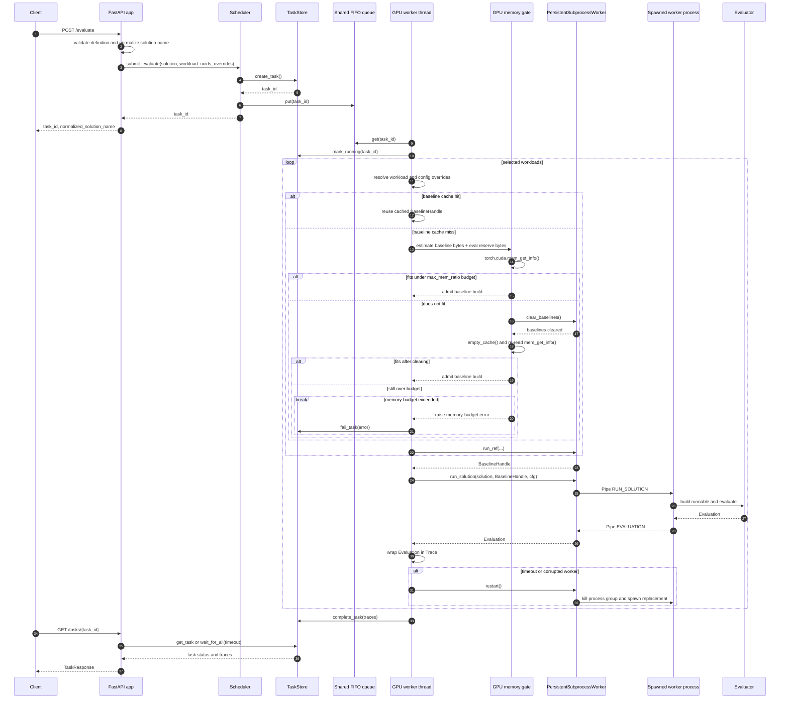
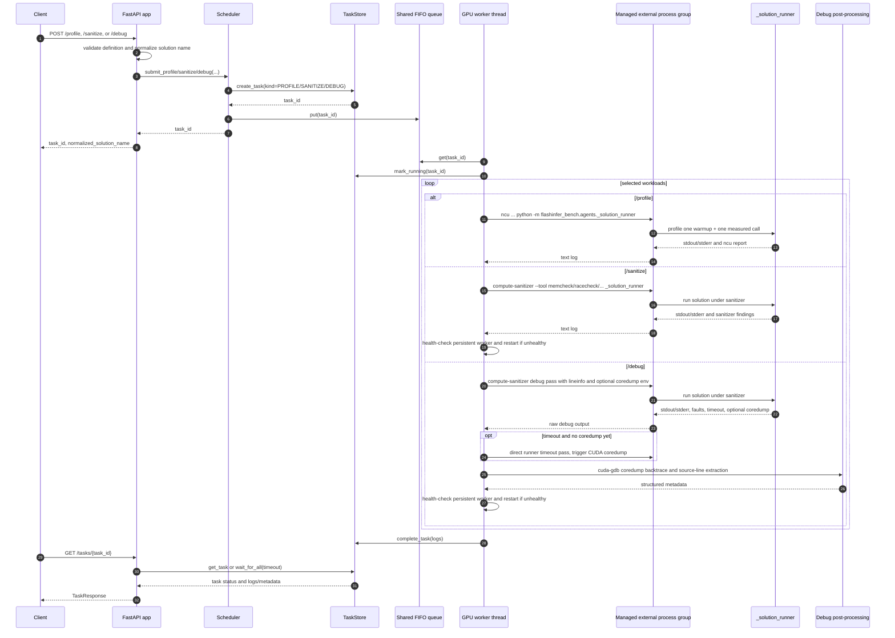
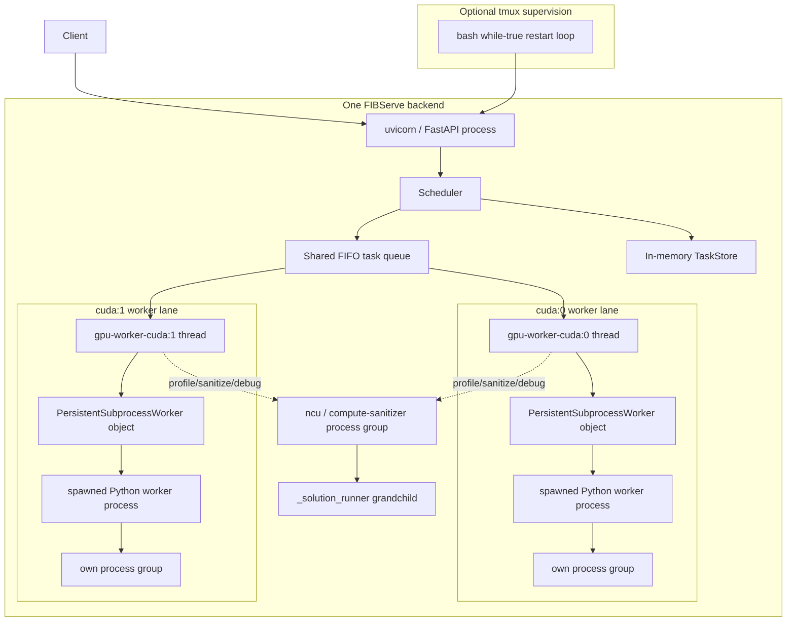
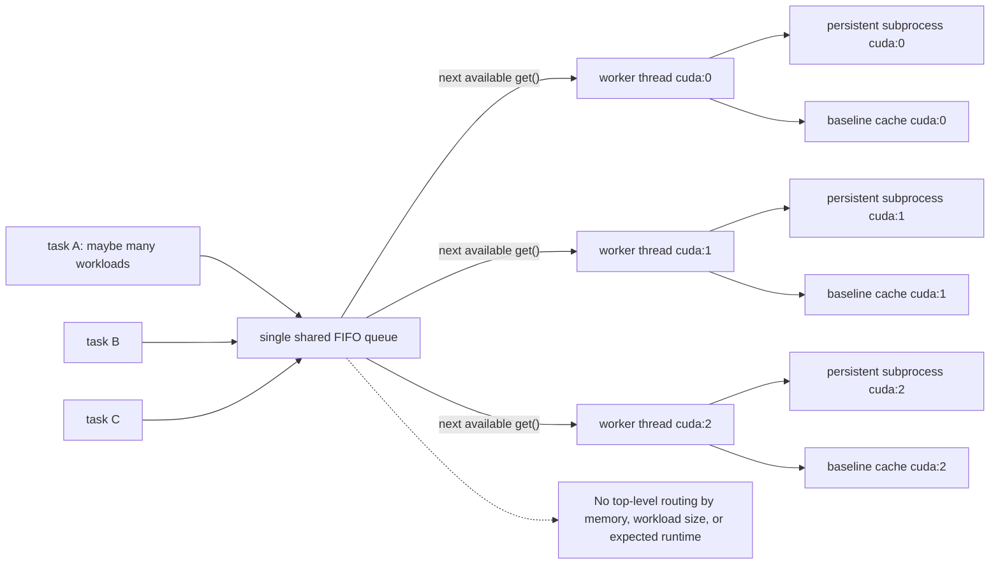
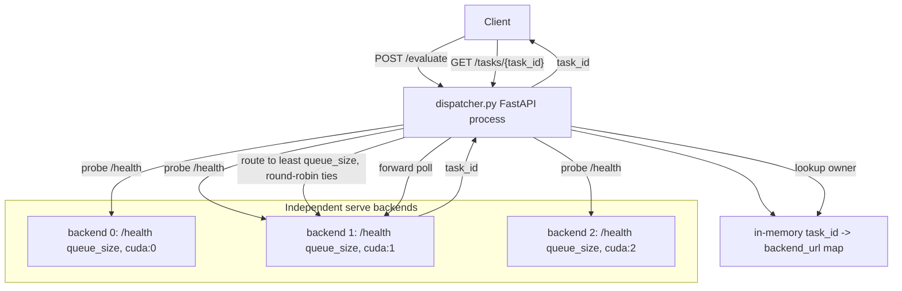
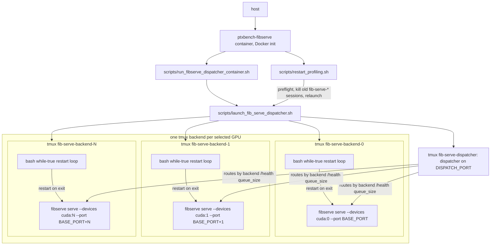

# FIBServe Request Flow

This document describes how a `fibserve serve` request is scheduled and served
in PTXBench, with emphasis on process ownership and failure boundaries. The
legacy `flashinfer-bench` command remains an alias for deployment compatibility.

## Diagrams

### Evaluate Request Sequence



### Profile, Sanitize, And Debug Request Sequence



### Process Topology



### Queue And Worker Scheduling



### Dispatcher Mode



### PTXBench Docker Deployment



## Startup

`fibserve serve` enters `serve()` in
[`flashinfer_bench/cli/main.py`](flashinfer_bench/cli/main.py:29). Startup does
the following:

1. Loads one or more local trace-set paths with `TraceSet.from_paths(args.local)`.
2. Resolves devices from `--devices`, or falls back to `list_cuda_devices()` when omitted.
3. Builds a `BenchmarkConfig` from `--config` plus CLI overrides such as `--timeout`, `--num-trials`, `--rtol`, and `--atol`.
4. Creates one `Scheduler(trace_set, config, devices)`.
5. Injects the scheduler into the FastAPI app with `init_app(scheduler)`.
6. Runs the process with `uvicorn.run(app, host=args.host, port=args.port)`.

The scheduler constructor creates one `_GPUWorkerThread` per device and a single shared FIFO `queue.Queue[str]` of task ids. The comments explicitly state that memory awareness is per worker, not top-level scheduling; workers self-select tasks from the shared queue ([`flashinfer_bench/serve/scheduler.py`](flashinfer_bench/serve/scheduler.py:99)).

Each `_GPUWorkerThread` starts immediately. On thread startup it creates a `PersistentSubprocessWorker` for its device, then loops on `self._queue.get(timeout=1.0)` until shutdown ([`flashinfer_bench/serve/scheduler.py`](flashinfer_bench/serve/scheduler.py:392)).

## Submit Path

The server exposes four asynchronous submit endpoints:

- `POST /evaluate`
- `POST /profile`
- `POST /sanitize`
- `POST /debug`

The FastAPI request models live in [`flashinfer_bench/serve/app.py`](flashinfer_bench/serve/app.py:31). `POST /evaluate` checks that the submitted solution's definition exists, normalizes the solution name with `Solution.with_unique_name()`, and calls `Scheduler.submit_evaluate(...)` ([`flashinfer_bench/serve/app.py`](flashinfer_bench/serve/app.py:240)).

`Scheduler.submit_evaluate()` optionally validates `run_baseline=False`, creates an in-memory `Task` in `TaskStore`, puts the task id into the shared FIFO queue, and returns the task id to the HTTP caller ([`flashinfer_bench/serve/scheduler.py`](flashinfer_bench/serve/scheduler.py:143)). Profile, sanitize, and debug submit methods follow the same create-task-and-enqueue pattern ([`flashinfer_bench/serve/scheduler.py`](flashinfer_bench/serve/scheduler.py:205)).

`TaskStore` is an in-process dictionary protected by a lock. It assigns `uuid.uuid4().hex`, creates a `threading.Event` for long polling, and records status as `pending`, `running`, `completed`, or `failed` ([`flashinfer_bench/serve/task_store.py`](flashinfer_bench/serve/task_store.py:84)).

## Local Scheduling

All local backend tasks use one global FIFO queue. There is no per-definition, per-workload, or per-memory routing at the top level. Any available `_GPUWorkerThread` can pop the next task id.

When a worker thread gets a task id, it:

1. Looks up the `Task` in `TaskStore`.
2. Marks it `running`.
3. Dispatches by `TaskKind`.
4. Stores either traces or logs on success, or stores an error on exception.
5. If an exception left the persistent worker unhealthy, restarts that worker.

This loop is in [`flashinfer_bench/serve/scheduler.py`](flashinfer_bench/serve/scheduler.py:404).

Important consequence: one task can include multiple workloads. Once a worker thread starts `_evaluate_task()`, it processes every selected workload sequentially on that same device before the task completes ([`flashinfer_bench/serve/scheduler.py`](flashinfer_bench/serve/scheduler.py:453)). A large multi-workload task can therefore occupy one worker for a long time, while scheduling granularity remains whole-task, not per-workload.

## Evaluation Flow

For `POST /evaluate`, `_evaluate_task()` resolves the definition and workload list, applies per-request overrides for `atol`, `rtol`, and `timeout`, then loops over workloads ([`flashinfer_bench/serve/scheduler.py`](flashinfer_bench/serve/scheduler.py:453)).

For each workload:

1. `_get_or_build_ref()` checks the worker-local `_baseline_cache` using `(definition.name, workload.uuid, profile_baseline, run_baseline)` as the key.
2. If absent, it resolves the effective benchmark config, estimates cached baseline bytes and transient evaluation reserve bytes, and calls `_admit_baseline()`.
3. `_admit_baseline()` reads real HBM usage with `torch.cuda.mem_get_info()`. If the new cached baseline plus live eval reserve does not fit under `max_mem_ratio`, it clears all cached baselines for that worker, re-reads memory, and only then fails early.
4. If admitted, `_gpu_worker.run_ref(...)` builds the reference baseline and returns a `BaselineHandle`; the scheduler caches that handle.
5. `_gpu_worker.run_solution(solution, ref_handle, task_cfg)` sends the solution-evaluation command to the long-lived subprocess.
6. The returned `Evaluation` is wrapped into a `Trace`.
7. On `TIMEOUT`, the worker is force-restarted. On other non-passing statuses, the scheduler health-checks the worker and restarts it if corrupted.

The cache-admission and clear-all behavior is in [`flashinfer_bench/serve/scheduler.py`](flashinfer_bench/serve/scheduler.py:609) and [`flashinfer_bench/serve/scheduler.py`](flashinfer_bench/serve/scheduler.py:696).

## GPU Memory Check Placement

GPU memory checking is an admission gate for building a new cached reference baseline during `/evaluate`. It is not a top-level scheduler decision and it is not run when the task is first enqueued.

The exact placement is:

1. The HTTP handler creates a task and puts its id on the shared FIFO queue without checking GPU memory.
2. A `_GPUWorkerThread` pops the task and starts `_evaluate_task()`.
3. For each selected workload, `_get_or_build_ref()` checks whether this worker already has a cached baseline handle.
4. If the baseline is cached, the memory gate is skipped and the solution runs against the cached handle.
5. If the baseline is missing, the worker estimates two quantities: cached baseline bytes and live evaluation reserve bytes.
6. `_admit_baseline()` reads actual device memory with `torch.cuda.mem_get_info()`, compares `used + required` against `max_mem_ratio * total HBM`, and admits immediately if it fits.
7. If it does not fit, the worker clears all cached baselines it owns, calls into `PersistentSubprocessWorker.clear_baselines()` when available, empties CUDA cache, re-reads actual memory, and admits only if it now fits.
8. If it still does not fit, the workload fails early with a memory-budget `RuntimeError`.

This means memory checking is **per backend process, per worker device, and per cache miss**. It does not choose which GPU should run a task. In dispatcher/profile-service mode, the dispatcher picks a backend using `/health` queue size first; once a one-GPU backend receives the request, that backend's own worker performs this memory admission when `/evaluate` needs a baseline.

The memory gate does not protect `/profile`, `/sanitize`, or `/debug` in the same way. Those endpoints run `ncu`, `compute-sanitizer`, or debug subprocesses around `_solution_runner`; they rely on the external process timeout/process-group cleanup path rather than baseline-cache admission.

## Persistent Worker Process

Each `_GPUWorkerThread` owns one `PersistentSubprocessWorker`. That object starts a child process with `torch.multiprocessing` using the `spawn` context and a duplex `Pipe` ([`flashinfer_bench/bench/runner/persistent_runner.py`](flashinfer_bench/bench/runner/persistent_runner.py:82)).

Process-management details:

- The worker child runs `_persistent_worker_main(conn, device)`.
- The child calls `os.setsid()` to enter a separate process group.
- The child installs `PR_SET_PDEATHSIG` via `set_parent_death_signal()`, so Linux kills it if its immediate parent dies.
- The parent stores the worker process group id when startup returns `READY`.
- Shutdown sends a `SHUTDOWN` command, waits up to 5 seconds, then kills the worker process group and terminates if still alive.
- Restart clears parent-side baselines and failure records, shuts down the old child, and starts a new child.

See [`flashinfer_bench/bench/runner/persistent_runner.py`](flashinfer_bench/bench/runner/persistent_runner.py:116), [`flashinfer_bench/bench/runner/persistent_runner.py`](flashinfer_bench/bench/runner/persistent_runner.py:131), and [`flashinfer_bench/bench/runner/persistent_runner.py`](flashinfer_bench/bench/runner/persistent_runner.py:259).

The subprocess command loop receives `RUN_SOLUTION`, `HEALTH_CHECK`, `CLEAR_BASELINES`, and `SHUTDOWN` commands ([`flashinfer_bench/bench/runner/persistent_runner.py`](flashinfer_bench/bench/runner/persistent_runner.py:761)). For `RUN_SOLUTION`, it:

1. Redirects stdout/stderr to a parent-provided temp log path.
2. Builds or retrieves the runnable from `BuilderRegistry`.
3. Clones baseline inputs before evaluation.
4. Resolves the evaluator and calls `evaluator_cls.evaluate(...)`.
5. Sends an `EVALUATION` response back over the pipe.
6. Converts build failures to `COMPILE_ERROR` and other exceptions to `RUNTIME_ERROR`.
7. Drops local tensor references and calls `torch.cuda.empty_cache()` before accepting the next command.

That flow is in [`flashinfer_bench/bench/runner/persistent_runner.py`](flashinfer_bench/bench/runner/persistent_runner.py:794).

The parent-side `run_solution()` waits on the pipe for `cfg.timeout_seconds`. A timeout returns an `EvaluationStatus.TIMEOUT`; the scheduler then force-restarts the persistent worker before accepting more tasks on that device ([`flashinfer_bench/bench/runner/persistent_runner.py`](flashinfer_bench/bench/runner/persistent_runner.py:386), [`flashinfer_bench/serve/scheduler.py`](flashinfer_bench/serve/scheduler.py:487)).

## Profile, Sanitize, And Debug Flow

Profile, sanitize, and debug tasks are scheduled through the same FIFO queue and worker threads, but they do not execute inside the persistent worker subprocess. The worker thread runs a separate per-workload tool flow:

- Profile calls `flashinfer_bench_run_ncu(...)` ([`flashinfer_bench/serve/scheduler.py`](flashinfer_bench/serve/scheduler.py:498)).
- Sanitize calls `flashinfer_bench_run_sanitizer(...)` ([`flashinfer_bench/serve/scheduler.py`](flashinfer_bench/serve/scheduler.py:531)).
- Debug calls `flashinfer_bench_debug_solution(...)` ([`flashinfer_bench/serve/scheduler.py`](flashinfer_bench/serve/scheduler.py:567)).

The differences are:

| Endpoint | Task kind | Main execution path | Output stored in task | Persistent worker use |
| --- | --- | --- | --- | --- |
| `/evaluate` | `EVALUATE` | Cached baseline plus `PersistentSubprocessWorker.run_solution()` over a pipe | `traces` with `Evaluation` objects | Main execution path; restarted on timeout/corruption |
| `/profile` | `PROFILE` | `ncu` wrapping `_solution_runner` | `logs[*].log` text | Not used for the profiled run; no post-run health check currently |
| `/sanitize` | `SANITIZE` | `compute-sanitizer` wrapping `_solution_runner` once per selected sanitizer tool | `logs[*].log` text | Not used for the sanitized run; health-checked after each workload |
| `/debug` | `DEBUG` | `compute-sanitizer` debug pass wrapping `_solution_runner`, optional direct timeout/coredump pass, optional `cuda-gdb` coredump backtrace | `logs[*].metadata` structured debug report | Not used for the debug run; health-checked after each workload |

NCU and compute-sanitizer write JSON files into a temporary directory, then launch `python -m flashinfer_bench.agents._solution_runner --data-dir ... --device ...` under the external tool. The command construction is in [`flashinfer_bench/agents/ncu.py`](flashinfer_bench/agents/ncu.py:80) and [`flashinfer_bench/agents/sanitizer.py`](flashinfer_bench/agents/sanitizer.py:23). The runner loads the definition, solution, and workload, builds the runnable, generates inputs, allocates outputs, warms up once, and runs the measured call ([`flashinfer_bench/agents/_solution_runner.py`](flashinfer_bench/agents/_solution_runner.py:22)).

External tools are launched through `run_managed_subprocess()`, not plain `subprocess.run()`. This helper starts a fresh session/process group, installs parent-death signal handling for the direct child, tracks active `Popen`s, kills the whole process group on timeout or exception, and allows graceful server shutdown to kill in-flight tool processes ([`flashinfer_bench/utils.py`](flashinfer_bench/utils.py:177), [`flashinfer_bench/utils.py`](flashinfer_bench/utils.py:241)). The NCU path explicitly documents that this is required for replay and orphan prevention ([`flashinfer_bench/agents/ncu.py`](flashinfer_bench/agents/ncu.py:297)); sanitizer has the same orphan-prevention note ([`flashinfer_bench/agents/sanitizer.py`](flashinfer_bench/agents/sanitizer.py:183)).

`/debug` is closer to `/sanitize` than to `/evaluate`: by default it uses `memcheck`, writes a debug directory under `FIB_DEBUG_DIR` or `/tmp/fib_debug`, forces NVCC `-lineinfo`, can enable CUDA user-triggered coredumps, triggers a coredump on timeout before killing the process group, may run a direct coredump timeout pass, then parses sanitizer output and `cuda-gdb` backtraces into metadata ([`flashinfer_bench/agents/debug.py`](flashinfer_bench/agents/debug.py:656)).

After sanitize or debug, the worker health-checks the persistent subprocess and restarts it if unhealthy. Profile currently does not do that post-run health check in `_profile_task()`.

## Polling And Results

`GET /tasks/{task_id}` delegates to `POST /tasks/batch` with a single id ([`flashinfer_bench/serve/app.py`](flashinfer_bench/serve/app.py:321)). If `timeout > 0`, FastAPI runs `TaskStore.wait_for_all(...)` in a thread, so the HTTP request long-polls on the task events without blocking the event loop.

Responses include task status plus either:

- `traces` for evaluate tasks, where each trace contains an `evaluation.status`;
- `logs` for profile/sanitize/debug tasks.

`task.status = completed` only means the server finished processing the task. The submitted solution may still have `COMPILE_ERROR`, `RUNTIME_ERROR`, `INCORRECT_*`, or `TIMEOUT` inside the trace evaluation.

## Shutdown

FastAPI lifespan shutdown calls `Scheduler.shutdown()` ([`flashinfer_bench/serve/app.py`](flashinfer_bench/serve/app.py:131)). `POST /shutdown` sends `SIGINT` to the current process ([`flashinfer_bench/serve/app.py`](flashinfer_bench/serve/app.py:377)).

Scheduler shutdown:

1. Sets the scheduler shutdown event.
2. Calls `kill_all_tracked_subprocesses()` to kill NCU/sanitizer/debug process groups that are currently blocked inside `communicate()`.
3. Joins each worker thread for up to 10 seconds.
4. Calls `worker.close()` for every worker, which closes the persistent subprocess worker.

See [`flashinfer_bench/serve/scheduler.py`](flashinfer_bench/serve/scheduler.py:292).

## Dispatcher Mode

`flashinfer_bench/serve/dispatcher.py` is an outer HTTP load balancer, not part
of a single backend's local scheduler. It fronts multiple independent
`fibserve serve` backends. Submit requests are routed to the healthy backend
with the smallest reported queue size, round-robin among ties, and
`task_id -> backend_url` is stored in the dispatcher process so future
`/tasks/{task_id}` queries go to the backend that owns the task
([`flashinfer_bench/serve/dispatcher.py`](flashinfer_bench/serve/dispatcher.py:29),
[`flashinfer_bench/serve/dispatcher.py`](flashinfer_bench/serve/dispatcher.py:201)).

The retained launcher uses tmux supervision:

- `scripts/launch_fib_serve_dispatcher.sh` starts one backend tmux session per
  configured device and one dispatcher tmux session. Each backend is wrapped
  in an infinite restart loop.
- `scripts/run_fibserve_dispatcher_container.sh` is the Docker entrypoint. It
  launches the topology and keeps PID 1 alive while the dispatcher exists.
- `scripts/restart_profiling.sh` performs CUDA and thermal preflight, removes
  only this service's tmux sessions and stale compiler/GPU children, and
  relaunches the same dispatcher topology without rebuilding the container.

The scheduler has an intentional hard-exit path: if a worker cannot be started
or restarted, `_GPUWorkerThread._exit_backend()` calls `os._exit(1)` so the
tmux restart loop can restart the whole backend process
([`flashinfer_bench/serve/scheduler.py`](flashinfer_bench/serve/scheduler.py:366)).

## PTXBench Profile Service Usage

`docker/compose.yaml` deploys the repo-local dispatcher mode. Each
`fibserve serve` backend process receives exactly one device from `FIB_DEVICES`,
and the dispatcher exposes a single profiling endpoint.

The deployment behavior is:

1. Compose mounts the host trace-set collection read-only, then passes the
   colon-separated `DATASET_ROOTS` list selecting one or more dataset
   directories within that mount. It also configures the selected GPU device
   IDs, Docker init, and one published dispatcher port.
2. `run_fibserve_dispatcher_container.sh` invokes
   `launch_fib_serve_dispatcher.sh` with `BENCH_ROOT`, `DATASET_ROOTS`,
   `CONFIG_PATH`, `DISPATCH_PORT`, `TIMEOUT`, `TMUX_PREFIX`, and `DEVICES`.
3. The launcher starts one tmux backend session per item in `DEVICES`; every
   backend command is `fibserve serve ... --devices <one cuda:N>
   --port <per-backend port>`, and a separate dispatcher tmux session fronts
   those backends.
4. `restart_profiling.sh` is the in-container restart path. It removes all tmux
   sessions with `TMUX_PREFIX`, kills leftover compiler and GPU processes,
   waits for cooldown, runs thermal/CUDA preflight, and reruns only the
   dispatcher launcher.

So this usage has two scheduling layers:

- Outer layer: the PTXBench FIBServe container and tmux launcher create one
  independent backend process per selected GPU, plus one dispatcher on
  `DISPATCH_PORT`.
- Inner layer: inside each one-GPU backend, the normal `Scheduler` still has a shared FIFO and one `_GPUWorkerThread`, because that backend was launched with only one `--devices cuda:N`.

Operationally, `/health` on the dispatcher reports aggregate backend health and queue size; a direct backend `/health` reports the one worker in that backend. A healthy dispatcher does not imply every backend has the same queue pressure or memory state.

## Process Tree Summary

Direct backend mode:

```text
tmux session
  bash while-true supervisor
    fibserve serve
      uvicorn / FastAPI process
        gpu-worker-cuda:N thread
          PersistentSubprocessWorker parent object
            spawned Python worker process, own process group
```

Evaluate task:

```text
HTTP POST /evaluate
  FastAPI handler
    Scheduler.submit_evaluate()
      TaskStore entry + shared FIFO task id
        _GPUWorkerThread pops task
          _get_or_build_ref()
            parent process builds/caches baseline handle
          PersistentSubprocessWorker.run_solution()
            Pipe RUN_SOLUTION
              spawned worker evaluates solution
            Pipe EVALUATION / ERROR / timeout
```

Profile or sanitizer task:

```text
HTTP POST /profile or /sanitize
  FastAPI handler
    Scheduler.submit_profile()/submit_sanitize()
      shared FIFO task id
        _GPUWorkerThread pops task
          ncu or compute-sanitizer process, own session/process group
            python -m flashinfer_bench.agents._solution_runner
```

Dispatcher mode:

```text
tmux dispatcher
  python -m flashinfer_bench.serve.dispatcher
    forwards submit to selected backend
    records task_id -> backend_url

tmux backend-N
  bash while-true supervisor
    fibserve serve --devices cuda:N --port BASE_PORT+N
```

## Possible Design Flaws To Review

These are not necessarily bugs, but they are pressure points in the current design.

1. Shared FIFO ignores memory and task size. The scheduler comments say top-level memory-aware assignment is not implemented. A task can land on a worker whose device has less free HBM, and a multi-workload task monopolizes one worker until all selected workloads finish.

2. Queue size is not load. `/health` reports only pending queue length, not currently running tasks or expected duration. The dispatcher picks by backend `queue_size`, so two backends with `queue_size=0` may be treated equally even if one is busy with a long-running task.

3. Tasks are process-local and volatile. `TaskStore` and dispatcher `task_to_url` are in-memory only. A backend or dispatcher restart loses task lookup state, even if the client still has a task id.

4. `TaskStore.cleanup()` exists but is not scheduled. Completed task records can accumulate for the lifetime of a backend process unless an external caller invokes cleanup.

5. Worker restart can intentionally kill the whole backend. `_exit_backend()` uses `os._exit(1)` when a worker cannot start or restart. This works with the tmux restart scripts, but drops all in-memory tasks on that backend.

6. Profile tasks do not post-check persistent worker health. Sanitize and debug explicitly health-check/restart after each workload; profile currently just returns logs. If NCU destabilizes shared GPU state outside its own process group, the persistent worker may not be refreshed until a later health path observes it.

7. Parent-side baseline construction is a GPU operation. `_get_or_build_ref()` calls `PersistentSubprocessWorker.run_ref()`, but that method builds the evaluator baseline in the backend process, not inside `_persistent_worker_main`. The returned tensors are stored in the parent-side `PersistentSubprocessWorker._baselines` map and passed through the pipe to the child for evaluation. This is deliberate for caching but means the uvicorn backend process owns CUDA allocations too.

8. Failure skipping is per persistent worker and keyed only by normalized solution name. After enough failures, `run_solution()` skips that solution on that worker. The record is cleared on worker restart, and identical normalized names across different definitions would share the same failure counter within a worker.

9. Timeout handling is cooperative at the parent boundary. `run_solution()` returns `TIMEOUT` when the pipe does not respond by `cfg.timeout_seconds`, then the scheduler restarts the worker. Until restart happens, the timed-out CUDA call may still be executing in the child.

10. Dispatcher task ownership is not recoverable. The dispatcher cannot discover which backend owns a previously submitted task after dispatcher restart, because ownership is only in `Dispatcher.task_to_url`.
