# 2026-0624-0939 Six-Mode Turn-Transition Alluvial Diagrams

Each SVG is for one model and one definition. Columns are turns 0..7; each turn aggregates all matched prompt tags and trajectories for that definition.

## Regular

### `mha_bwd_d128`

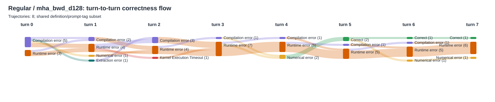

### `mha_bwd_d128_causal`

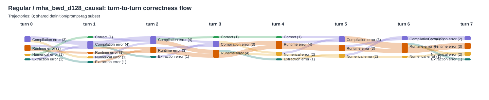

### `mha_with_lse_d128`

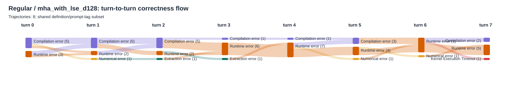

### `mha_with_lse_d128_causal`

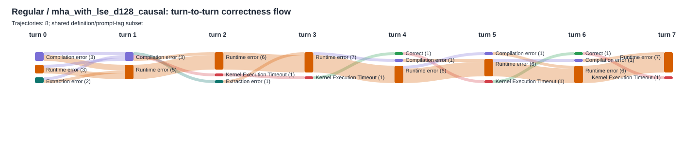

## Regular patched

### `mha_bwd_d128`

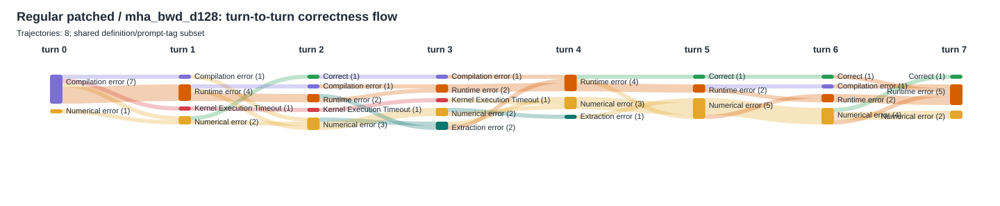

### `mha_bwd_d128_causal`

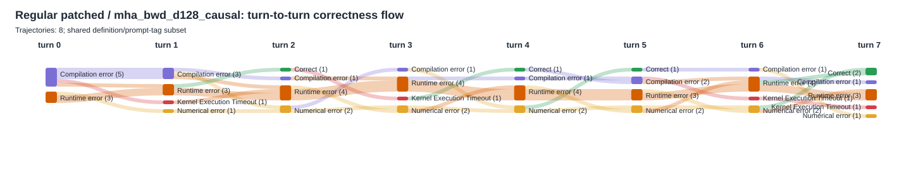

### `mha_with_lse_d128`

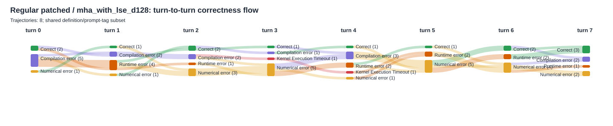

### `mha_with_lse_d128_causal`

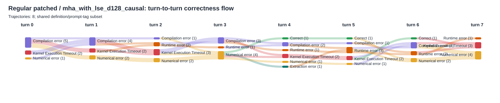

## Linfo

### `mha_bwd_d128`

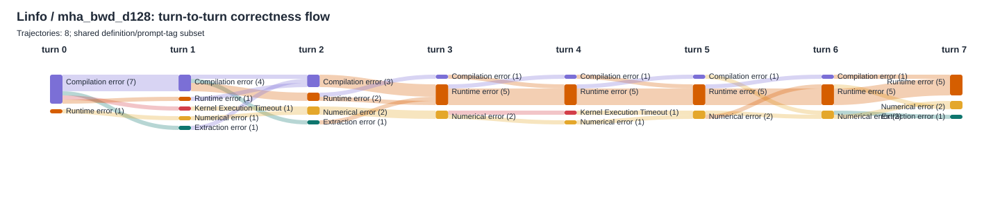

### `mha_bwd_d128_causal`

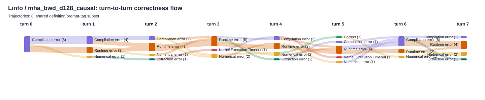

### `mha_with_lse_d128`

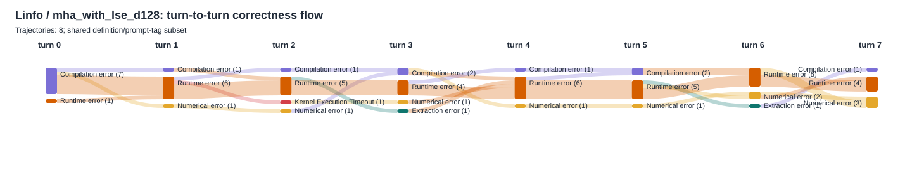

### `mha_with_lse_d128_causal`

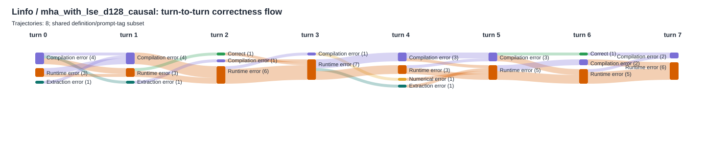

## Linfo patched

### `mha_bwd_d128`

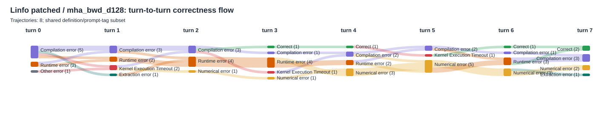

### `mha_bwd_d128_causal`

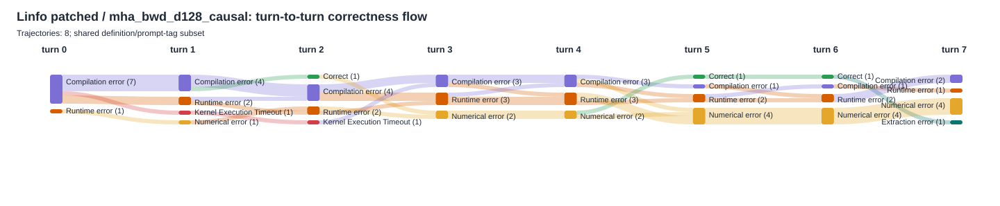

### `mha_with_lse_d128`

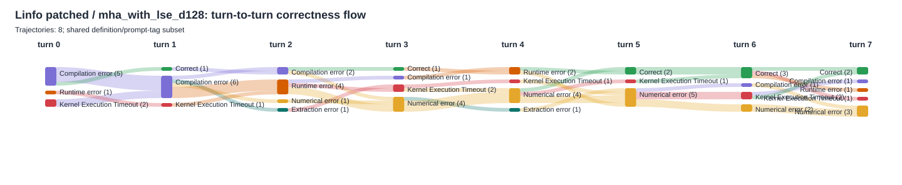

### `mha_with_lse_d128_causal`

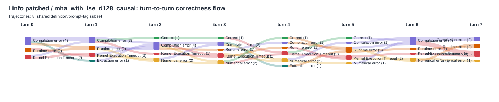

## Linfo single-user

### `mha_bwd_d128`

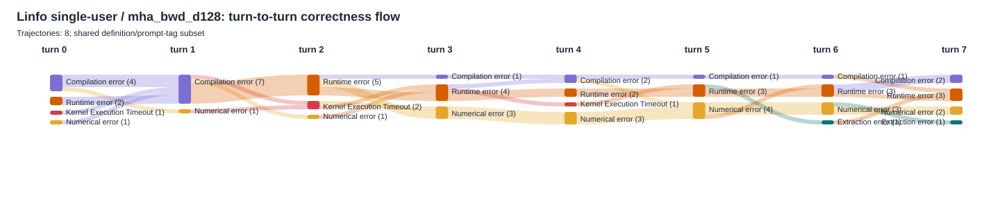

### `mha_bwd_d128_causal`

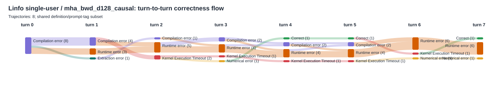

### `mha_with_lse_d128`

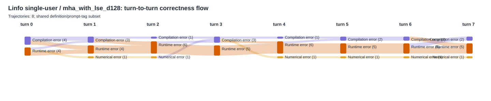

### `mha_with_lse_d128_causal`

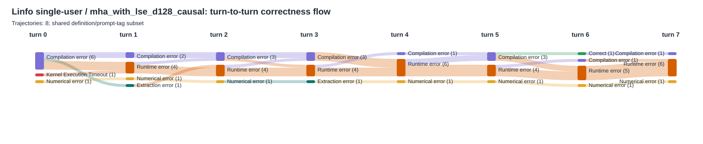

## Latest-pair patched

### `mha_bwd_d128`

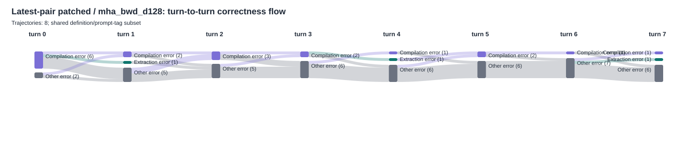

### `mha_bwd_d128_causal`

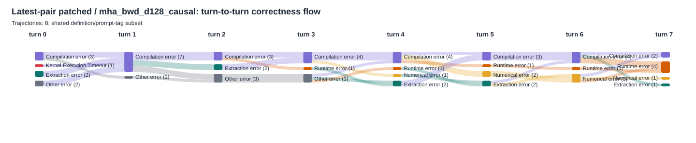

### `mha_with_lse_d128`

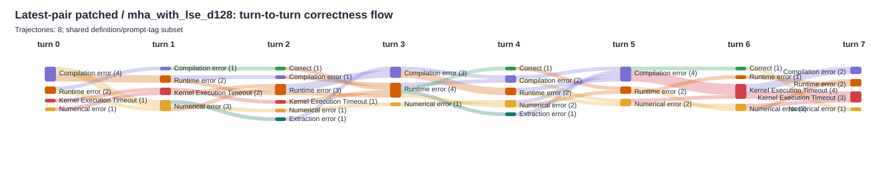

### `mha_with_lse_d128_causal`

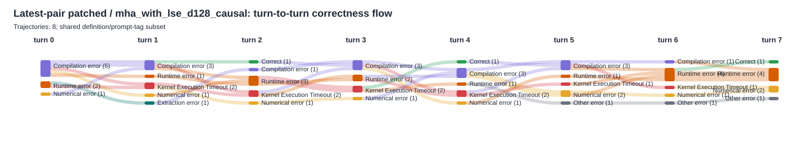
