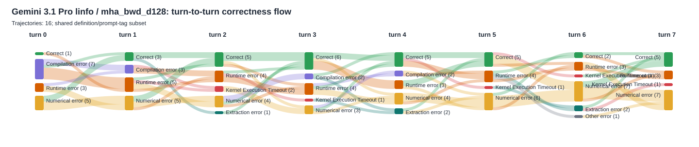
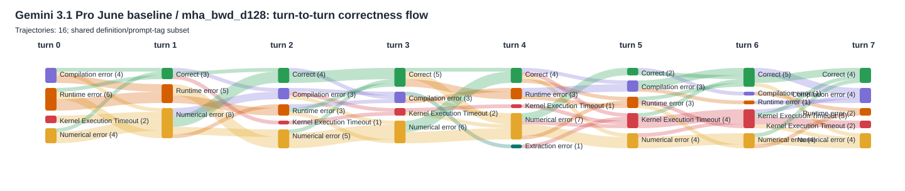
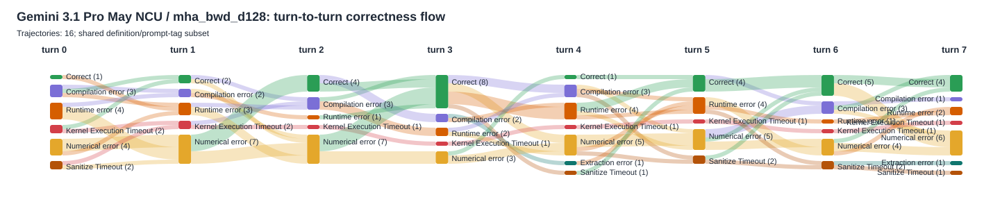

# Gemini 3.1 Pro MHA Backward d128: Linfo vs June Baseline vs May NCU: Turn-Transition Alluvial Diagrams

Each SVG is for one model/stage and one definition. Columns retain that run's original turn numbers; each turn aggregates all selected prompt-tag pairs and available trajectories for that definition.

## Gemini 3.1 Pro linfo

### `mha_bwd_d128`

## Gemini 3.1 Pro June baseline

### `mha_bwd_d128`

## Gemini 3.1 Pro May NCU

### `mha_bwd_d128`

