# Blackwell: Gemini vs Claude Opus 4.8 vs GLM-5.2 vs Fixit v5: Turn-Transition Alluvial Diagrams

Each SVG is for one model/stage and one definition. Columns retain that run's original turn numbers; each turn aggregates all selected prompt-tag pairs and available trajectories for that definition.

## Gemini 3.1 Pro Preview

### `gemm_n7168_k5120`

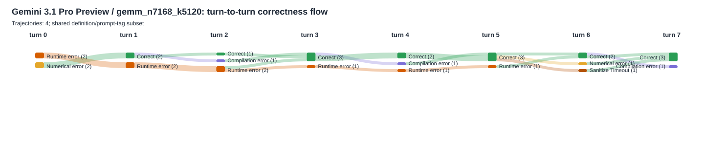

### `mha_bwd_d128`

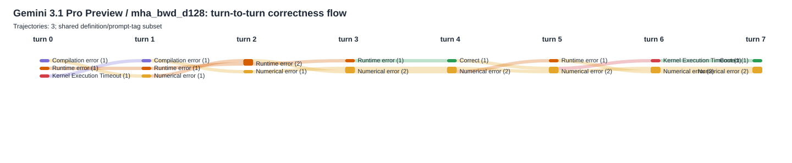

### `mha_bwd_d128_causal`

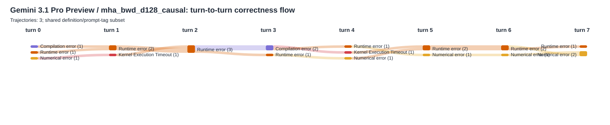

### `mha_with_lse_d128`

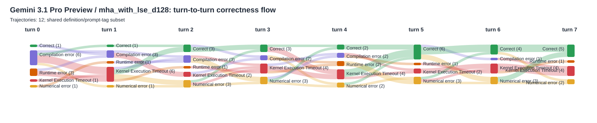

### `mha_with_lse_d128_causal`

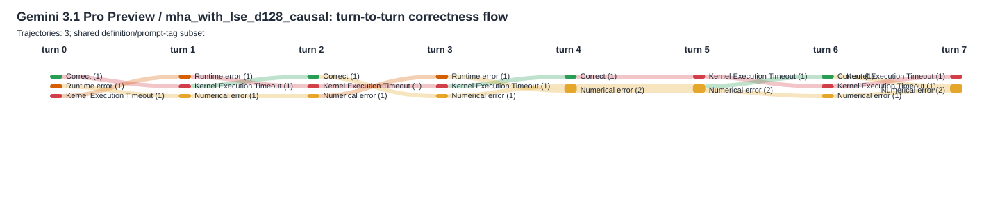

## Claude Opus 4.8 xhigh

### `gemm_n7168_k5120`

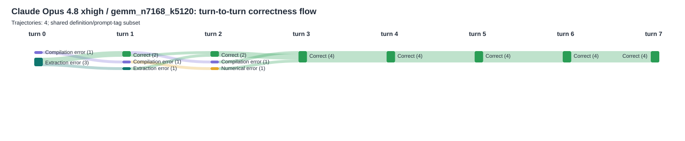

### `mha_bwd_d128`

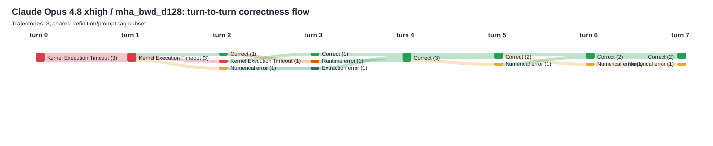

### `mha_bwd_d128_causal`

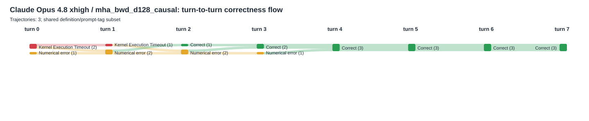

### `mha_with_lse_d128`

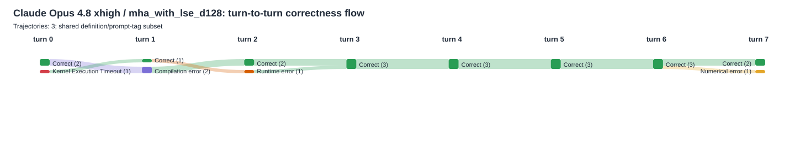

### `mha_with_lse_d128_causal`

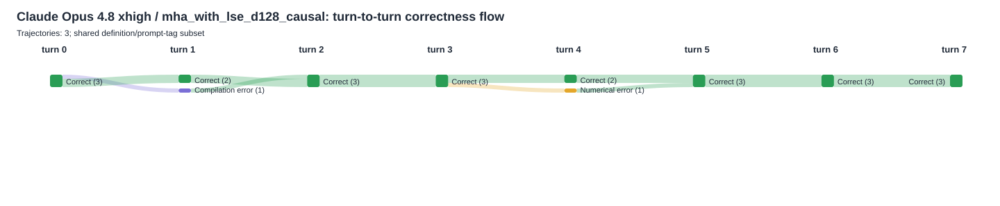

## GLM-5.2

### `gemm_n7168_k5120`

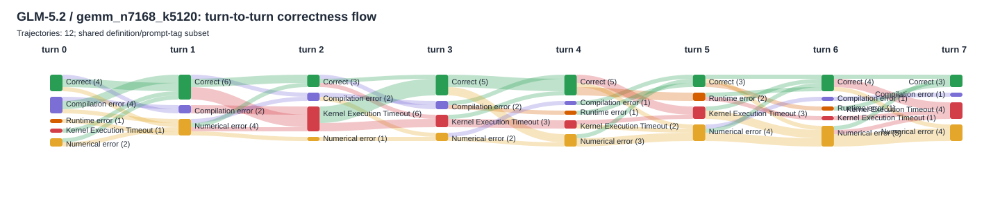

### `mha_bwd_d128`

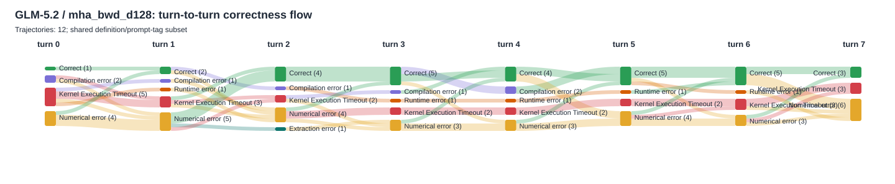

### `mha_bwd_d128_causal`

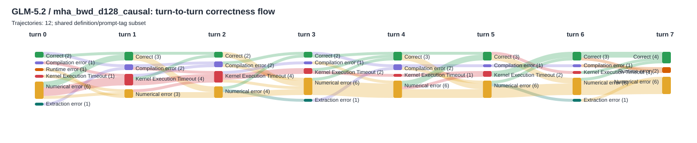

### `mha_with_lse_d128`

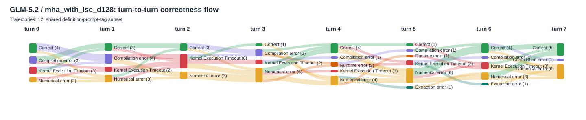

### `mha_with_lse_d128_causal`

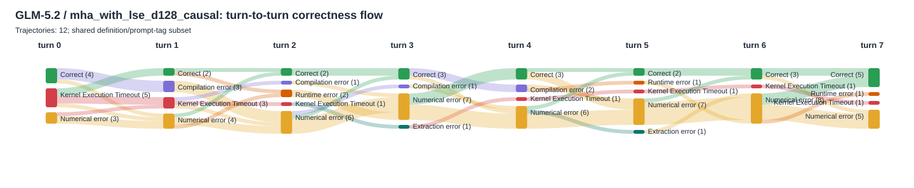

## Fixit v5

### `gemm_n7168_k5120`

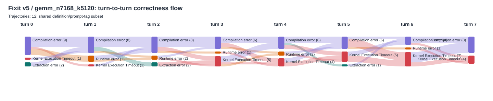

### `mha_bwd_d128`

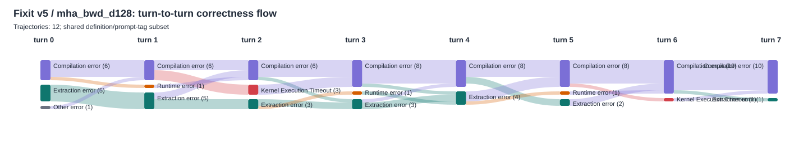

### `mha_bwd_d128_causal`

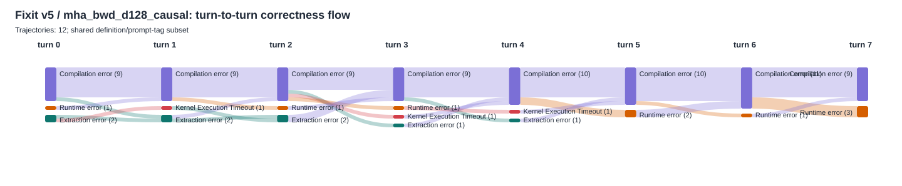

### `mha_with_lse_d128`

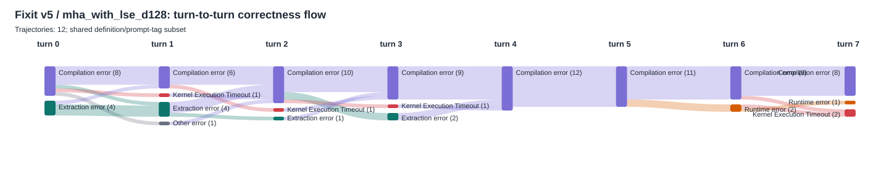

### `mha_with_lse_d128_causal`

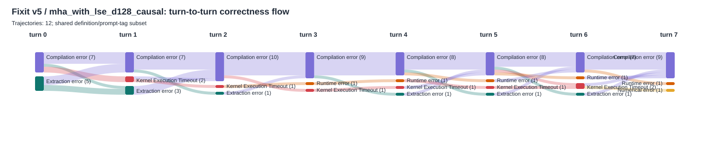
