# Qwen3.6-27B Base-Model Turn-Transition Alluvial Diagrams

Each SVG is for one model and one definition. Columns are turns 0..7; each turn aggregates all matched prompt tags and trajectories for that definition.

## Regular patched

### `mha_bwd_d128`

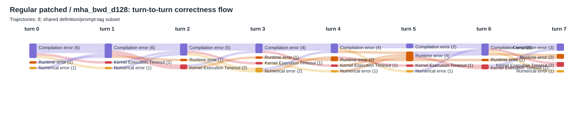

### `mha_bwd_d128_causal`

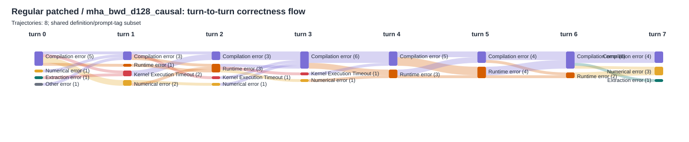

### `mha_with_lse_d128`

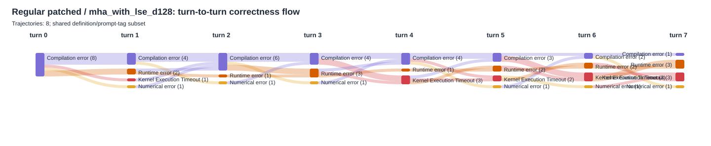

### `mha_with_lse_d128_causal`

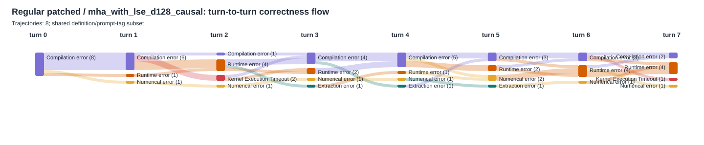

## Linfo

### `mha_bwd_d128`

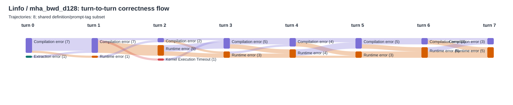

### `mha_bwd_d128_causal`

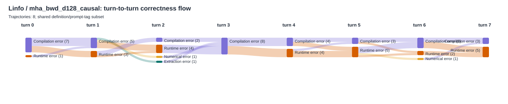

### `mha_with_lse_d128`

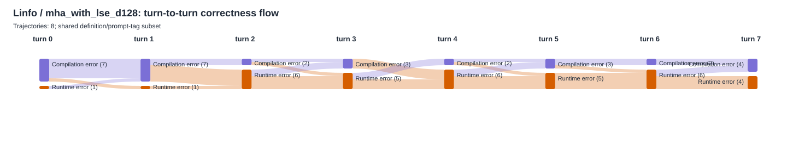

### `mha_with_lse_d128_causal`

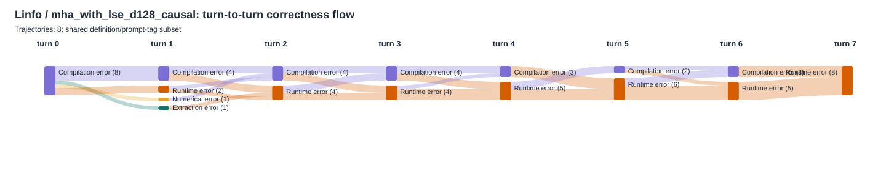

## Single-user

### `mha_bwd_d128`

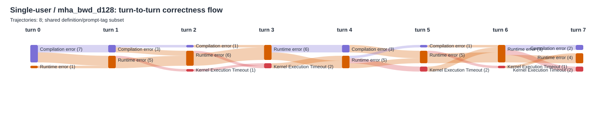

### `mha_bwd_d128_causal`

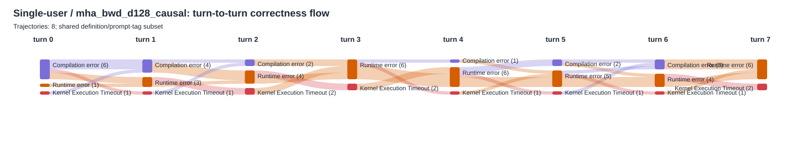

### `mha_with_lse_d128`

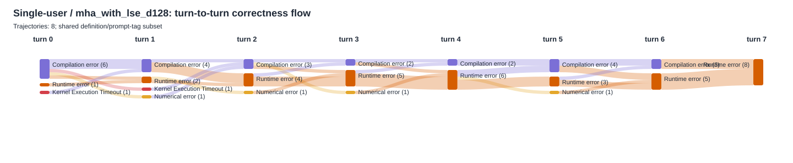

### `mha_with_lse_d128_causal`

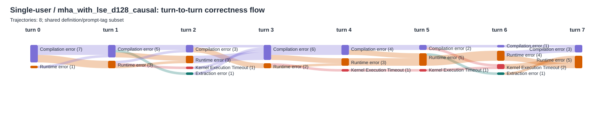
