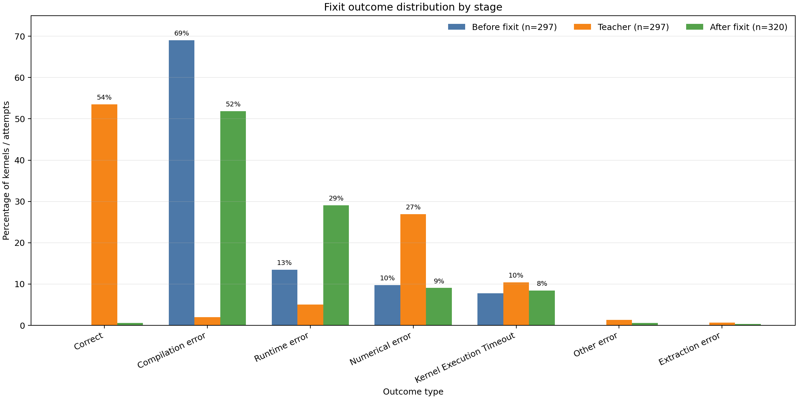

# Fixit Settings Notes

This note summarizes the current recommendation for Gemini fixit data collection
and Qwen3.6-27B follow-up spending, based on the two Gemini fixit runs:

- `/home/ubuntu/AccRL-exps/eval_runs/test-fixit-qwen36-27b-gemini`
- `/home/ubuntu/AccRL-exps/eval_runs/scale-d128-fixit-qwen36-27b-gemini`

The per-wrong-kernel audit table is:

`/home/ubuntu/AccRL-exps/tasks/test_scale_gemini_fixit_wrong_kernel_table.csv`

## Prompt Diversity vs More Problems

Recommendation: spend most of the next Qwen3.6-27B budget on more wrong
kernels/problems, not broad prompt variation.

Rationale:

- The current prompt-tag rates are not a clean A/B test because each prompt tag
  was assigned to different wrong kernels.
- Across the two runs, Gemini fixed `159 / 297 = 53.5%` wrong kernels.
- Later repair attempts were still useful: first successes occurred on fix turns
  2, 3, and 4 in substantial numbers.
- The remaining unfixed set is dominated by `Numerical error`, suggesting
  algorithmic/correctness difficulty more than prompt wording alone.

Before-fixing error counts by problem/definition for the selected wrong
kernels:

| Definition | Wrong kernels | Compilation error | Runtime error | Numerical error | Kernel Execution Timeout |
| --- | ---: | ---: | ---: | ---: | ---: |
| `mha_bwd_d128` | 72 | 47 | 10 | 8 | 7 |
| `mha_bwd_d128_causal` | 74 | 49 | 8 | 10 | 7 |
| `mha_with_lse_d128` | 75 | 53 | 13 | 4 | 5 |
| `mha_with_lse_d128_causal` | 76 | 56 | 9 | 7 | 4 |
| **Total** | **297** | **205** | **40** | **29** | **23** |

For this count, each row in the audit table was joined back to its original
`source_run` `figures/turn_correctness_arch.csv` by `source_exp` and
`source_turn`.

Fixit-v2 GLM first-four-turn counts for the same four d128 definitions:

| Definition | Attempts | Correct | Errors | Compilation error | Runtime error | Numerical error | Kernel Execution Timeout | Other error | Extraction error |
| --- | ---: | ---: | ---: | ---: | ---: | ---: | ---: | ---: | ---: |
| `mha_bwd_d128` | 80 | 0 | 80 | 46 | 24 | 0 | 8 | 2 | 0 |
| `mha_bwd_d128_causal` | 80 | 0 | 80 | 51 | 18 | 7 | 3 | 0 | 1 |
| `mha_with_lse_d128` | 80 | 1 | 79 | 34 | 29 | 8 | 8 | 0 | 0 |
| `mha_with_lse_d128_causal` | 80 | 1 | 79 | 35 | 22 | 14 | 8 | 0 | 0 |
| **Total** | **320** | **2** | **318** | **166** | **93** | **29** | **27** | **2** | **1** |

For this count, rows are attempted turns `0` through `3` from the
`2026-0629-2229-mha*` fixit-v2 GLM eval roots. Those roots each have `20`
trajectories for the corresponding definition, so the first-four-turn slice is
`80` attempted turns per definition.

Gemini teacher final-outcome counts by problem/definition, including correct
kernels:

| Definition | Wrong kernels | Correct | Numerical error | Kernel Execution Timeout | Runtime error | Compilation error | Other error | Extraction error |
| --- | ---: | ---: | ---: | ---: | ---: | ---: | ---: | ---: |
| `mha_bwd_d128` | 72 | 32 | 25 | 8 | 7 | 0 | 0 | 0 |
| `mha_bwd_d128_causal` | 74 | 40 | 20 | 8 | 4 | 1 | 0 | 1 |
| `mha_with_lse_d128` | 75 | 42 | 15 | 11 | 2 | 3 | 1 | 1 |
| `mha_with_lse_d128_causal` | 76 | 45 | 20 | 4 | 2 | 2 | 3 | 0 |
| **Total** | **297** | **159** | **80** | **31** | **15** | **6** | **4** | **2** |

For this count, a row is `Correct` if any Gemini fix turn in `fix_turn_0`
through `fix_turn_4` has a numeric speedup. Otherwise, the bucket is the final
non-`none` error in that row.

Unfixed final-error counts by problem/definition from the audit table:

| Definition | Unfixed | Numerical error | Kernel Execution Timeout | Runtime error | Compilation error | Other error | Extraction error |
| --- | ---: | ---: | ---: | ---: | ---: | ---: | ---: |
| `mha_bwd_d128` | 40 | 25 | 8 | 7 | 0 | 0 | 0 |
| `mha_bwd_d128_causal` | 34 | 20 | 8 | 4 | 1 | 0 | 1 |
| `mha_with_lse_d128` | 33 | 15 | 11 | 2 | 3 | 1 | 1 |
| `mha_with_lse_d128_causal` | 31 | 20 | 4 | 2 | 2 | 3 | 0 |
| **Total** | **138** | **80** | **31** | **15** | **6** | **4** | **2** |

For this count, an unfixed row is a wrong kernel with no numeric speedup in
`fix_turn_0` through `fix_turn_4`; the bucket is the final non-`none` error in
that row.

Stage distribution plot:

The plot normalizes each stage independently: before-fixit uses `297` original
wrong kernels, teacher uses the `297` Gemini final outcomes above, and
after-fixit uses `320` first-four-turn attempts from the fixit-v2 GLM eval
roots.

Recommended spending split:

| Spend | Recommendation |
| --- | --- |
| 80-90% | Run on more wrong kernels/problems, especially new definitions or uncovered turns/problems. |
| 10-20% | Run a controlled prompt sweep on the same hard kernels to measure prompt effect cleanly. |

For the prompt sweep, use the same wrong kernels under multiple prompt tags.
Pick about 30 shared wrong kernels from the unfixed set, stratified by final
error type, and compare prompt tags such as `hopper-08`, `hopper-no-hint`, and
`hopper-07` or `hopper-013`.

Suggested targets for more-problem spending:

- `mha_bwd_d128`, which had the lowest fixed rate in this slice:
  `32 / 72 = 44.4%`.
- Source turn `3`, which had the lowest fixed rate by source turn:
  `31 / 75 = 41.3%`.
- Unfixed kernels ending in `Numerical error`, the largest remaining failure
  bucket.

## Gemini Stop Threshold

Recommendation: keep Gemini fixit collection at a realistic correctness
threshold such as `target_speedup = 0.15`, then filter or weight correct kernels
later for SFT. Do not use `1.2` as the online Gemini stop target for this
pipeline.

Observed speedup distribution from the two Gemini runs:

| Metric | Value |
| --- | ---: |
| Correct fix turns total | 201 |
| Correct first-fix kernels | 159 |
| Correct turns with speedup `>= 1.2` | 0 |
| Correct turns with speedup `>= 1.0` | 0 |
| Correct turns with speedup `>= 0.5` | 9 |
| Median correct speedup | ~0.159 |
| Max correct speedup | ~0.69 |

Implication:

- A `1.2` stop threshold would almost never early-stop on the observed
  distribution.
- It would spend extra Gemini turns after already-correct-but-slow kernels.
- In the existing logs, kernels whose first correct fix was below `1.2` did not
  later produce a `>=1.2` correct kernel.

Recommended policy:

| Goal | Policy |
| --- | --- |
| Build fixit SFT data | Stop at `0.15`; collect all correct kernels. |
| Train for quality | Filter or weight later by speedup, using realistic cutoffs such as `>=0.15`, top-k per wrong kernel, or top quantile. |
| Explore performance | Run a small separate experiment with a higher target such as `0.5`; avoid making `1.2` the main collection threshold. |
| Spend main budget | Prefer more wrong kernels/problems over chasing high speedups with Gemini. |

Bottom line: collect correctness-rich fixit data with `target_speedup = 0.15`,
then apply downstream filtering/weighting. Treat high-speedup chasing as a
separate small experiment, not the default data-generation path.
